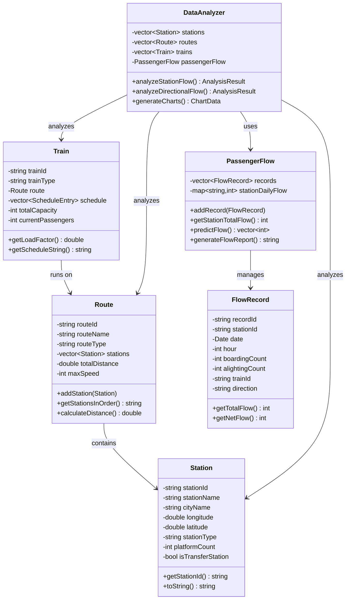

# 川渝地区轨道交通客流数据分析与展示系统 - 设计文档

## 1. 需求分析

### 1.1 项目背景
川渝地区双城经济圈战略的深化实施，轨道交通系统已成为支撑区域经济协同发展的核心载体。截至2024年，该区域轨道交通运营总里程突破1200公里，日均客流量超过800万人次。

### 1.2 系统目标
- 构建轨道交通领域的实体模型
- 实现客流数据的处理与分析
- 提供数据可视化和决策支持
- 预测客流变化趋势

### 1.3 功能需求

#### 1.3.1 核心功能
1. **基础数据管理**
   - 站点信息管理（增删改查）
   - 线路信息管理（站点顺序、线路属性）
   - 列车信息管理（时刻表、载客量）
   - 客流记录管理（上下客数据）

2. **数据分析功能**
   - 站点客流统计和排行
   - 川渝双向流量对比分析
   - 列车载客率分析
   - 时段客流分布分析

3. **预测功能**
   - 基于历史数据的客流预测
   - 方向性流量预测
   - 站点流量趋势预测

4. **可视化展示**
   - 客流热力图
   - 趋势对比图表
   - 载客率可视化
   - 站点流量柱状图

5. **数据存储**
   - CSV格式数据导入导出
   - 配置文件管理
   - 数据备份和恢复

#### 1.3.2 扩展功能
- 地图显示铁路网络
- 实时数据更新
- Web界面版本
- 更复杂的预测算法

### 1.4 性能需求
- 支持处理100+站点数据
- 支持100万+客流记录
- 响应时间<2秒
- 内存占用<500MB

### 1.5 用户需求
- 铁路管理人员：数据分析和决策支持
- 运营人员：实时监控和调度优化
- 学生用户：学习数据分析方法

## 2. 系统架构设计

### 2.1 整体架构
```
┌─────────────────────────────────────────────────────────────┐
│                    用户界面层 (UI Layer)                      │
├─────────────────────────────────────────────────────────────┤
│                    业务逻辑层 (Business Layer)                │
│  ┌─────────────┐  ┌─────────────┐  ┌─────────────────────┐   │
│  │ DataAnalyzer│  │    System   │  │   PassengerFlow     │   │
│  │    数据分析  │  │    Manager  │  │     客流管理        │   │
│  └─────────────┘  └─────────────┘  └─────────────────────┘   │
├─────────────────────────────────────────────────────────────┤
│                    数据模型层 (Data Model Layer)              │
│  ┌─────────────┐  ┌─────────────┐  ┌─────────────────────┐   │
│  │   Station   │  │    Route    │  │       Train         │   │
│  │    站点模型  │  │   线路模型   │  │      列车模型        │   │
│  └─────────────┘  └─────────────┘  └─────────────────────┘   │
├─────────────────────────────────────────────────────────────┤
│                    数据访问层 (Data Access Layer)             │
│  ┌─────────────┐  ┌─────────────┐  ┌─────────────────────┐   │
│  │ FileManager │  │  CSV Reader │  │     Config Mgr      │   │
│  │   文件管理   │  │  CSV解析器   │  │     配置管理        │   │
│  └─────────────┘  └─────────────┘  └─────────────────────┘   │
└─────────────────────────────────────────────────────────────┘
```

### 2.2 模块划分

#### 2.2.1 核心模块
- **数据模型模块**: Station, Route, Train, FlowRecord
- **业务逻辑模块**: PassengerFlow, DataAnalyzer
- **数据访问模块**: FileManager
- **用户界面模块**: Console UI / Qt GUI

#### 2.2.2 辅助模块
- **工具模块**: Date, TimePoint, 数据结构
- **配置模块**: 系统配置管理
- **日志模块**: 错误处理和日志记录

## 3. 类图设计

### 3.1 核心类关系图



### 3.2 类设计详情

#### 3.2.1 Station类
```cpp
class Station {
private:
    string stationId;          // 站点ID
    string stationName;        // 站点名称  
    string cityName;           // 所属城市
    double longitude;          // 经度
    double latitude;           // 纬度
    string stationType;        // 站点类型
    int platformCount;         // 站台数量
    bool isTransferStation;    // 是否为换乘站

public:
    // 构造函数、析构函数
    // Getter/Setter方法
    // 功能方法：toString(), 比较操作符等
};
```

#### 3.2.2 Route类
```cpp
class Route {
private:
    string routeId;                    // 线路ID
    string routeName;                  // 线路名称
    string routeType;                  // 线路类型
    vector<shared_ptr<Station>> stations;  // 站点列表
    double totalDistance;              // 总长度
    int maxSpeed;                      // 最高速度

public:
    // 站点管理方法
    void addStation(shared_ptr<Station> station);
    void removeStation(const string& stationId);
    shared_ptr<Station> findStation(const string& stationId);
    
    // 业务方法
    string getStationsInOrder();
    double calculateDistance(const string& from, const string& to);
};
```

#### 3.2.3 Train类
```cpp
class Train {
private:
    string trainId;                    // 列车号
    string trainType;                  // 列车类型
    shared_ptr<Route> route;           // 运行线路
    vector<ScheduleEntry> schedule;    // 时刻表
    int totalCapacity;                 // 总载客量
    int currentPassengers;             // 当前载客数

public:
    // 时刻表管理
    void addScheduleEntry(const ScheduleEntry& entry);
    TimePoint getArrivalTime(const string& stationId);
    
    // 业务方法
    double getLoadFactor();            // 载客率
    string getScheduleString();        // 时刻表字符串
};
```

## 4. 功能模型设计

### 4.1 数据流程图

```
原始数据 → 数据清洗 → 数据存储 → 数据分析 → 结果展示
    ↓           ↓          ↓          ↓          ↓
  CSV文件   → 验证格式 → 内存结构 → 统计计算 → 图表报告
  手动输入  → 完整性检查 → 数据库   → 预测算法 → 可视化界面
```

### 4.2 主要业务流程

#### 4.2.1 数据加载流程
1. 系统启动，初始化数据结构
2. FileManager加载CSV文件
3. 解析数据并创建对象实例
4. 建立对象间的关联关系
5. 数据验证和完整性检查

#### 4.2.2 客流分析流程
1. 选择分析时间范围和条件
2. PassengerFlow筛选相关记录
3. DataAnalyzer执行统计计算
4. 生成AnalysisResult结果
5. 格式化输出分析报告

#### 4.2.3 预测分析流程
1. 收集历史客流数据
2. 计算统计特征（均值、趋势等）
3. 应用预测算法（移动平均、线性回归等）
4. 生成预测结果
5. 输出预测报告和建议

### 4.3 算法设计

#### 4.3.1 客流统计算法
```cpp
// 站点总客流统计
int getStationTotalFlow(const string& stationId) {
    int total = 0;
    for (const auto& record : records) {
        if (record.getStationId() == stationId) {
            total += record.getTotalFlow();
        }
    }
    return total;
}
```

#### 4.3.2 载客率计算算法
```cpp
// 列车载客率计算
double getLoadFactor() {
    if (totalCapacity == 0) return 0.0;
    return (double(currentPassengers) / totalCapacity) * 100.0;
}
```

#### 4.3.3 简化预测算法
```cpp
// 基于历史平均的预测
vector<int> predictFlow(const string& stationId, int days) {
    // 1. 计算历史平均流量
    int avgFlow = getStationTotalFlow(stationId) / getHistoryDays();
    
    // 2. 生成预测结果
    vector<int> prediction(days, avgFlow);
    
    return prediction;
}
```

## 5. 数据库设计

### 5.1 文件存储结构
```
data/
├── stations.csv       # 站点数据
├── routes.csv         # 线路数据  
├── trains.csv         # 列车数据
├── flow_records.csv   # 客流记录
├── config.txt         # 配置文件
└── backup/            # 备份目录
```

### 5.2 CSV文件格式

#### 5.2.1 stations.csv
```csv
StationID,StationName,CityName,Longitude,Latitude,StationType,PlatformCount,IsTransferStation
CQ001,重庆北站,重庆,106.5516,29.8132,起始站,8,1
CQ002,重庆西站,重庆,106.4270,29.5308,中间站,6,0
```

#### 5.2.2 flow_records.csv
```csv
RecordID,StationID,StationName,Date,Hour,BoardingCount,AlightingCount,TrainID,Direction
F001,CD001,成都东站,2024-12-15,8,350,120,G8501,川->渝
F002,CQ001,重庆北站,2024-12-15,9,380,150,G8502,渝->川
```

## 6. 用户界面设计

### 6.1 控制台界面
- 菜单驱动的文本界面
- 功能模块化，易于导航
- 清晰的数据展示格式
- 错误处理和用户提示

### 6.2 Qt图形界面（扩展）
- 主窗口：菜单栏、工具栏、状态栏
- 数据管理页面：表格展示、增删改查
- 分析页面：图表展示、参数设置
- 报告页面：报告生成、导出功能

## 7. 测试设计

### 7.1 单元测试
- 各类的基本功能测试
- 边界值测试
- 异常处理测试

### 7.2 集成测试
- 模块间接口测试
- 数据流测试
- 业务流程测试

### 7.3 系统测试
- 功能完整性测试
- 性能测试
- 用户界面测试

## 8. 部署设计

### 8.1 编译环境
- C++17标准
- CMake 3.10+
- 支持Windows/Linux/macOS

### 8.2 运行环境  
- 最小内存：512MB
- 磁盘空间：100MB
- 操作系统：Windows 10+/Linux/macOS

### 8.3 安装部署
- 提供可执行文件
- 包含示例数据
- 提供用户手册

## 9. 维护设计

### 9.1 版本管理
- 使用Git进行版本控制
- 语义化版本号
- 变更日志记录

### 9.2 错误处理
- 统一的错误码定义
- 详细的错误日志
- 用户友好的错误提示

### 9.3 性能优化
- 内存管理优化
- 算法复杂度优化
- 文件I/O优化 