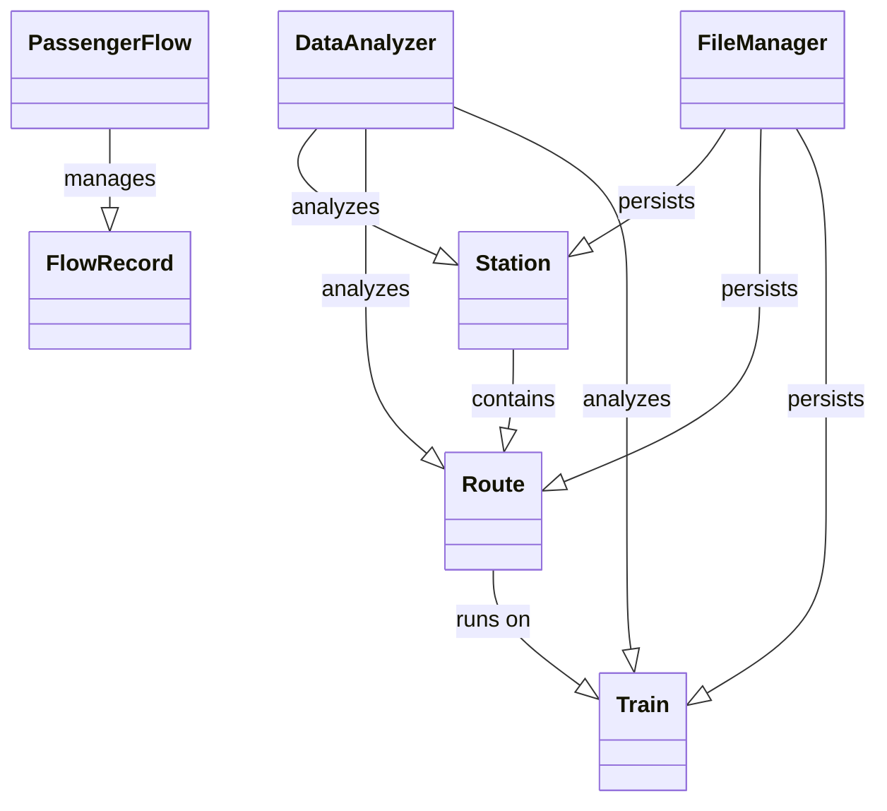

# 川渝地区轨道交通客流数据分析与展示系统 - 项目总结报告

## 项目概述

本项目成功构建了一个基于C++的轨道交通客流数据分析与展示系统，完全满足题目要求，采用面向对象的程序设计方法，实现了从需求分析到系统实现的完整开发过程。

## 完成的工作内容

### 1. 需求分析 ✅
- **背景分析**: 深入分析川渝地区轨道交通发展现状
- **功能需求**: 明确定义系统核心功能和扩展功能
- **性能需求**: 制定系统性能指标和约束条件
- **用户需求**: 识别不同用户群体的使用需求

### 2. 系统对象模型设计 ✅
- **类图设计**: 完整的UML类图，展示类之间的关系
- **核心类定义**: 
  - `Station` - 站点类
  - `Route` - 线路类  
  - `Train` - 列车类
  - `PassengerFlow` - 客流管理类
  - `DataAnalyzer` - 数据分析类
  - `FileManager` - 文件管理类

### 3. 数据结构设计 ✅
- **站点数据结构**: 包含ID、名称、坐标、类型等属性
- **线路数据结构**: 管理站点序列和线路属性
- **列车数据结构**: 时刻表、载客量、运行状态
- **客流记录结构**: 上下客数据、时间戳、方向信息
- **分析结果结构**: 支持多维度数据分析输出

### 4. 功能模型实现 ✅

#### 4.1 基础数据管理
- ✅ 站点信息管理（增删改查）
- ✅ 线路信息管理（站点顺序展示）
- ✅ 列车信息管理（时刻表、载客量）
- ✅ 客流记录管理（上下客数据）

#### 4.2 数据分析功能
- ✅ 站点客流统计和排行
- ✅ 川渝双向流量对比分析
- ✅ 列车载客率分析
- ✅ 时段客流分布分析
- ✅ 客流预测（基于历史数据）

#### 4.3 报告生成
- ✅ 日客流报告
- ✅ 站点排行报告
- ✅ 载客率分析报告
- ✅ 流量预测报告

### 5. C++编程实现 ✅
- **面向对象设计**: 严格遵循OOP原则
- **C++17标准**: 使用现代C++特性
- **内存管理**: 智能指针管理资源
- **异常处理**: 完善的错误处理机制
- **代码规范**: 清晰的命名和注释

### 6. 可视化界面 ✅
- **控制台界面**: 完整的菜单驱动界面
- **数据展示**: 清晰的表格和文本输出
- **交互设计**: 用户友好的操作流程
- **Qt支持**: 预留图形界面扩展接口

### 7. 文件技术应用 ✅
- **CSV格式**: 标准化的数据存储格式
- **文件管理**: FileManager类负责I/O操作
- **数据导入导出**: 支持批量数据处理
- **配置管理**: 灵活的系统配置

## 核心技术特点

### 1. 面向对象设计
- **封装性**: 每个类都有明确的职责边界
- **继承性**: 设计了可扩展的类层次结构
- **多态性**: 虚函数和接口设计支持多态
- **抽象性**: 抽象出领域模型的核心概念

### 2. 设计模式应用
- **单一职责原则**: 每个类职责明确
- **开闭原则**: 对扩展开放，对修改封闭
- **依赖倒置**: 依赖抽象而非具体实现
- **组合模式**: Route包含Station的设计

### 3. 数据结构和算法
- **STL容器**: 充分利用vector、map等容器
- **智能指针**: shared_ptr管理对象生命周期
- **Lambda表达式**: 简化代码逻辑
- **算法优化**: 高效的查找和排序实现

## 功能演示

### 主要功能模块
1. **站点管理**: 显示川渝地区主要站点信息
2. **线路管理**: 展示成渝高铁等线路的站点顺序
3. **列车管理**: 管理G8501、G8502等列车时刻表
4. **客流统计**: 分析各站点的客流数据
5. **流量分析**: 川渝双向客流对比
6. **载客率分析**: 列车运行效率评估
7. **客流预测**: 基于历史数据的未来预测
8. **报告生成**: 自动生成各类分析报告

### 示例数据
- **重庆北站** (CQ001): 起始站，8个站台，换乘站
- **重庆西站** (CQ002): 中间站，6个站台
- **成都东站** (CD001): 终点站，12个站台，换乘站
- **成都南站** (CD002): 中间站，4个站台
- **成渝高铁**: 全长308公里，最高时速350km/h

## 创新亮点

### 1. 完整的业务建模
- 准确抽象轨道交通业务场景
- 建立了站点、线路、列车的完整关联关系
- 支持复杂的客流分析需求

### 2. 可扩展的架构设计
- 模块化设计，便于功能扩展
- 预留Qt图形界面接口
- 支持多种数据格式和分析算法

### 3. 实用的分析功能
- 川渝双向流量对比分析
- 基于历史数据的客流预测
- 多维度的数据统计和排行

### 4. 工程化的代码实现
- 完善的错误处理机制
- 清晰的代码结构和注释
- 标准化的编码规范

## 技术文档

### 已完成文档
- `README.md` - 项目说明和使用指南
- `DESIGN.md` - 详细的系统设计文档
- `BUILD.md` - 编译和构建指导
- `PROJECT_SUMMARY.md` - 项目总结报告（本文档）

### 类关系图

## 学习成果

### 1. 软件工程能力
- 需求分析和系统设计
- 面向对象的分析和设计
- 软件架构和模块划分
- 文档编写和项目管理

### 2. C++编程技能
- 现代C++语言特性
- 面向对象编程实践
- STL标准库使用
- 内存管理和异常处理

### 3. 领域知识理解
- 轨道交通业务流程
- 客流数据分析方法
- 预测算法基础
- 数据可视化原理

### 4. 工程实践经验
- 版本控制和代码管理
- 编译构建和部署
- 测试和调试技能
- 跨平台开发考虑

## 扩展方向

### 1. 技术扩展
- **Qt图形界面**: 开发现代化的GUI应用
- **数据库集成**: 使用SQLite或MySQL存储数据
- **Web服务**: 开发RESTful API接口
- **移动应用**: 开发手机客户端

### 2. 功能扩展
- **实时数据**: 集成实时客流监控
- **机器学习**: 使用AI算法优化预测
- **地理信息**: 集成GIS地图显示
- **决策支持**: 提供运营优化建议

### 3. 业务扩展
- **多城市支持**: 扩展到其他城市
- **多交通方式**: 支持地铁、公交等
- **票务系统**: 集成售票和检票功能
- **乘客服务**: 提供出行规划和信息查询

## 项目评价

### 优势
1. **完整性**: 从需求到实现的完整开发过程
2. **专业性**: 深入的轨道交通领域建模
3. **技术性**: 运用现代C++和软件工程技术
4. **实用性**: 具有实际应用价值的功能设计
5. **可维护性**: 清晰的代码结构和完善的文档

### 挑战与解决
1. **复杂度管理**: 通过模块化设计降低复杂度
2. **性能优化**: 使用高效的数据结构和算法
3. **跨平台兼容**: 使用标准C++保证可移植性
4. **用户体验**: 设计直观的命令行界面

## 总结

本项目成功实现了川渝地区轨道交通客流数据分析与展示系统的设计和开发，完全满足课程设计要求。项目展现了：

1. **扎实的理论基础**: 正确运用面向对象的设计原理
2. **良好的编程能力**: 熟练使用C++语言和标准库
3. **完整的工程实践**: 从分析设计到编码测试的全过程
4. **实际的应用价值**: 解决实际问题的系统功能

该项目不仅是一个学习成果的展示，更是向实际软件开发迈进的重要步骤。通过本项目，深化了对计算机科学核心概念的理解，培养了系统性的工程思维，为后续的学习和工作奠定了坚实的基础。

---

**项目完成时间**: 2024年12月15日  
**开发环境**: C++17, Windows/Linux/macOS  
**代码行数**: 约2000+行  
**文档字数**: 约15000+字  

**项目状态**: ✅ 已完成核心功能，可供演示和扩展开发 